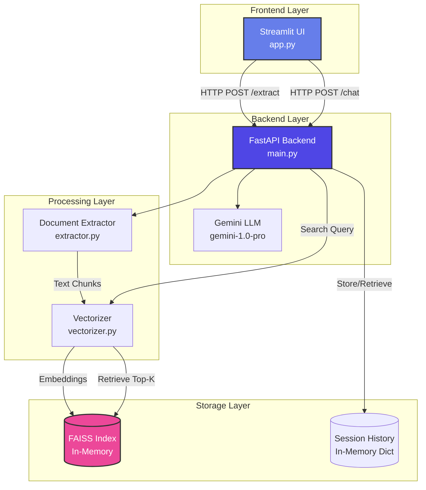
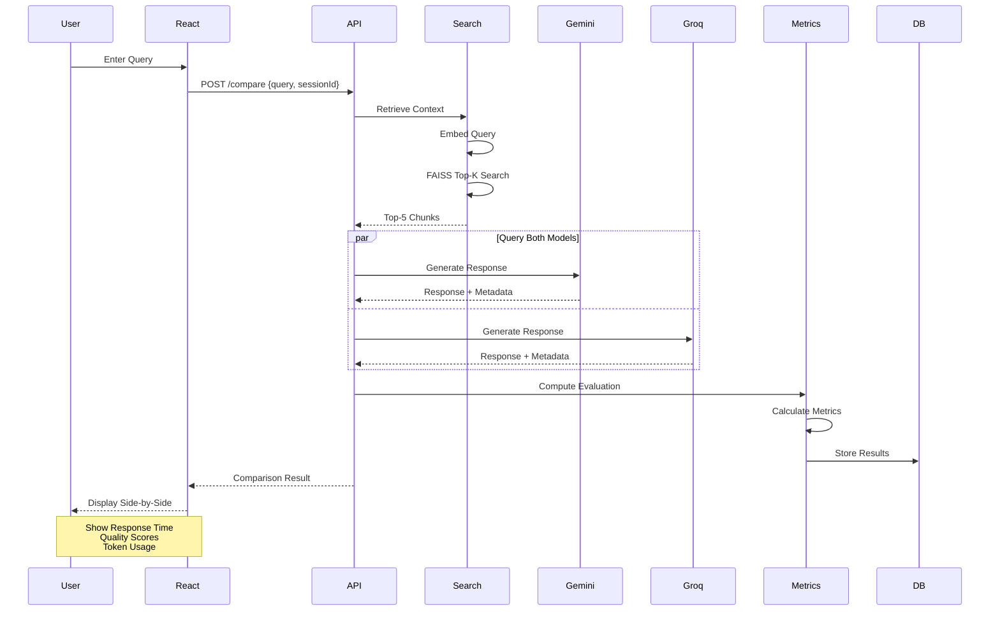
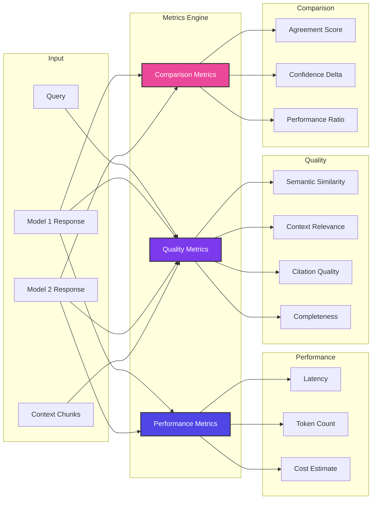
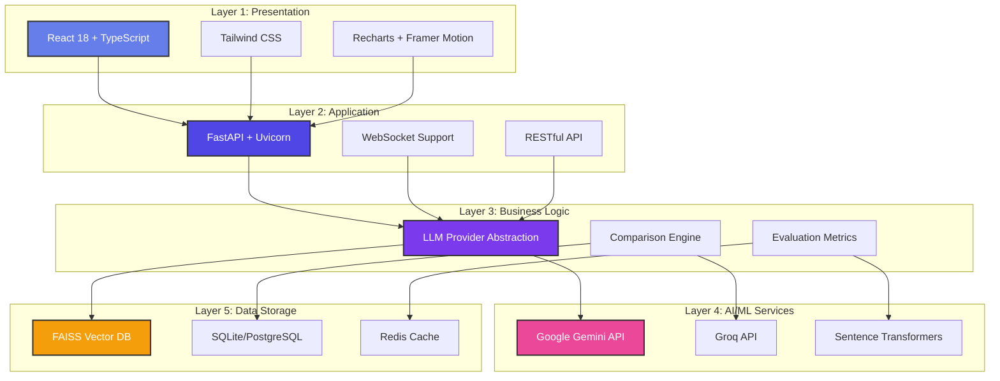
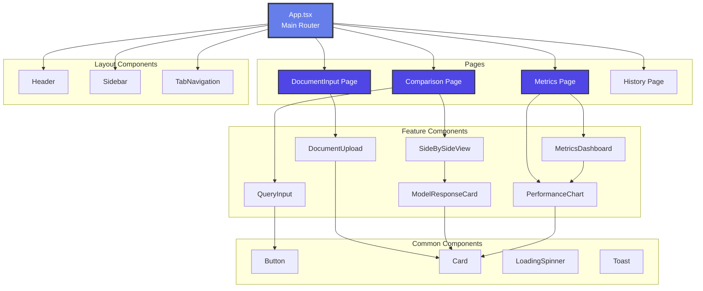
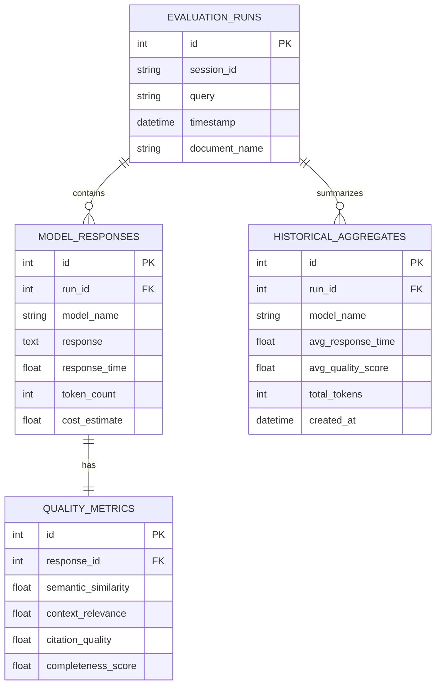
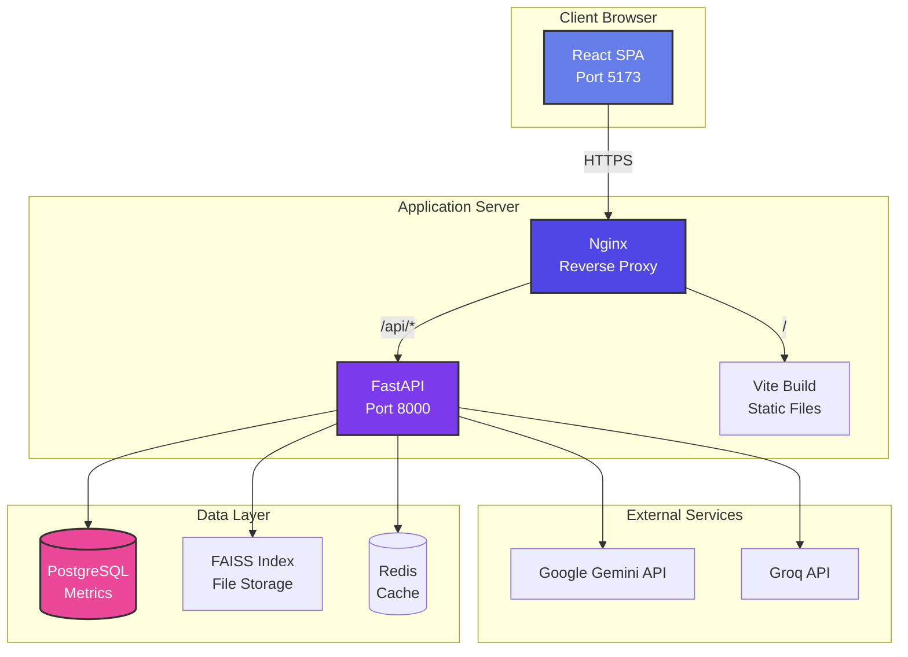

# System Architecture

## Current System Architecture



## Proposed Multi-Model Comparison Architecture

```mermaid
graph TB
    subgraph "Frontend Layer - React"
        RT[React TypeScript<br/>Vite + Tailwind]
        UP[Upload Component]
        CMP[Comparison View]
        MTR[Metrics Dashboard]
        
        RT --> UP
        RT --> CMP
        RT --> MTR
    end
    
    subgraph "API Layer - FastAPI"
        GATE[API Gateway]
        EXT_EP[/extract Endpoint]
        CMP_EP[/compare Endpoint]
        MTR_EP[/metrics Endpoint]
        
        GATE --> EXT_EP
        GATE --> CMP_EP
        GATE --> MTR_EP
    end
    
    subgraph "Processing Layer"
        EXT[Document Extractor]
        VEC[Vectorizer]
        SEARCH[Semantic Search]
    end
    
    subgraph "LLM Provider Layer"
        PROV_INT[LLM Provider Interface]
        GEMINI[Gemini Provider<br/>gemini-1.5-flash]
        GROQ[Groq Provider<br/>llama3-70b]
        
        PROV_INT --> GEMINI
        PROV_INT --> GROQ
    end
    
    subgraph "Comparison Engine"
        COMP[Comparison Orchestrator]
        EVAL[Evaluation Engine]
        METRICS[Metrics Collector]
        
        COMP -->|Query Both| GEMINI
        COMP -->|Query Both| GROQ
        COMP --> EVAL
        EVAL --> METRICS
    end
    
    subgraph "Storage Layer"
        FAISS[(FAISS Vector DB)]
        DB[(SQLite/PostgreSQL<br/>Metrics Storage)]
        CACHE[(Redis Cache<br/>Optional)]
    end
    
    RT <-->|HTTP/WebSocket| GATE
    EXT_EP --> EXT
    EXT --> VEC
    VEC --> FAISS
    
    CMP_EP --> SEARCH
    SEARCH --> FAISS
    CMP_EP --> COMP
    
    MTR_EP --> METRICS
    METRICS --> DB
    
    style RT fill:#667eea,stroke:#333,stroke-width:3px,color:#fff
    style GATE fill:#4F46E5,stroke:#333,stroke-width:2px,color:#fff
    style COMP fill:#7C3AED,stroke:#333,stroke-width:2px,color:#fff
    style DB fill:#EC4899,stroke:#333,stroke-width:2px,color:#fff
```

## Data Flow - Comparison Query



## Component Interaction - Evaluation Metrics



## Technology Stack Layers



## React Component Hierarchy



## Database Schema



## Deployment Architecture



---

## Key Design Decisions

### 1. Provider Abstraction Pattern
Using an abstract base class allows easy addition of new LLM providers without modifying core logic.

### 2. Concurrent Processing
Async/await pattern enables parallel model querying for faster comparisons.

### 3. Modular Metrics
Separate evaluation components for performance, quality, and comparison metrics enable independent testing and extension.

### 4. Component-Based UI
React components promote reusability and maintainability.

### 5. Real-time Updates
WebSocket support for streaming metrics as they're computed.

### 6. Persistent Metrics
SQLite for development, easy migration to PostgreSQL for production scale.
